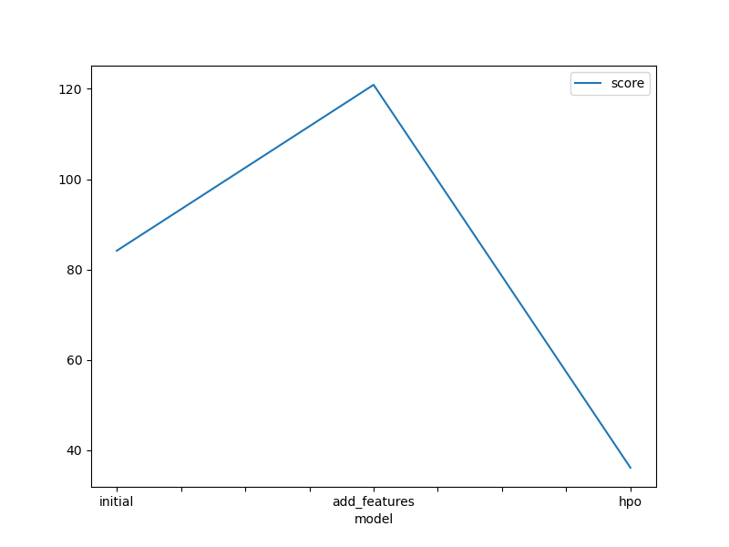
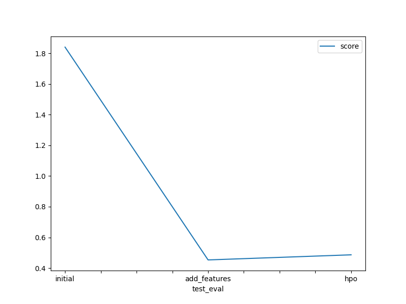

# Report: Predict Bike Sharing Demand with AutoGluon Solution
#### Govind K

## Initial Training
### What did you realize when you tried to submit your predictions? What changes were needed to the output of the predictor to submit your results?
The minimum value in the predictions was 0.370618 which was greater than 0. For the predictions to be submitted in Kaggle, all values should be greater than 0. Since the minimum value in the dataset is greater than 0 I realized there were no negative values and there was no need to change any value.

### What was the top ranked model that performed?
KNeighborsDist_BAG_L1

## Exploratory data analysis and feature creation
### What did the exploratory analysis find and how did you add additional features?
The "temp" feature gave kind of a symmetric histogram, the "casual" and "registered" features gave a little left skewed histogram and the "count" feature gave a right skewed histogram.
For additional features I split the datetime column into hour,date,month and year columns.

### How much better did your model preform after adding additional features and why do you think that is?
There was more than 40% increase in model score value. So the additional features really did help. It hepled the model because the splitting gives more information to the model about the dataset and thus helping with the predictions.

## Hyper parameter tuning
### How much better did your model preform after trying different hyper parameters?
When the leaderboard of the models with the new features was compared with leaderboard of the models with different hyper parameters, the model score of the best performed model with different hyper parameters was significantly less than the best performed model with the new features. The performance of the model with hyper parameters was decreased.
But there was a bit of an increase in the Kaggle score value.

### If you were given more time with this dataset, where do you think you would spend more time?
I would try to find the features that doesn't have very low correlation with the target feature and remove them and keep the features that have some correlation with the target feature.

### Create a table with the models you ran, the hyperparameters modified, and the kaggle score.
| model        | hpo1                                                                                                                                                                                                                                                                                                            |                                                                                      hpo2 | hpo3                                                                                                                                                                                                        | score   |
|--------------|-----------------------------------------------------------------------------------------------------------------------------------------------------------------------------------------------------------------------------------------------------------------------------------------------------------------|------------------------------------------------------------------------------------------:|-------------------------------------------------------------------------------------------------------------------------------------------------------------------------------------------------------------|---------|
| initial      |                                                                                                                                                                                                                                                                                                    default vals |                                                                              default vals |                                                                                                                                                                                                default vals | 0.45301 |
| add_features |                                                                                                                                                                                                                                                                                                    default vals |                                                                              default vals |                                                                                                                                                                                                default vals | 0.45301 |
|          hpo | NN  'num_epochs': 10, 'learning_rate': ag.space.Real(1e-4, 1e-2,  default=5e-4, log=True), 'activation': ag.space.Categorical('relu', 'softrelu', 'tanh'),  'layers': ag.space.Categorical([100], [1000], [200, 100], [300, 200, 100]),  'dropout_prob': ag.space.Real(0.0, 0.5, default=0.1) | GBM 'num_boost_round': 100,  'num_leaves': ag.space.Int(lower=26, upper=66, default=36 | CAT  'iterations': (100, 1000), 'learning_rate': (0.01, 0.03), 'depth': (4, 10),'l2_leaf_reg': (0, 100), 'random_strength': (1, 10), 'colsample_bylevel': (0.5, 1), 'subsample': (0.5, 1) | 0.48624 |

### Create a line plot showing the top model score for the three (or more) training runs during the project.

### Create a line plot showing the top kaggle score for the three (or more) prediction submissions during the project.

TODO: Replace the image below with your own.

## Summary
The goal of the machine learning study was to forecast demand for bike sharing using the AutoGluon product. Model selection, hyperparameter tweaking, and feature engineering are all made easier with the help of the automated machine learning framework AutoGluon. Starting with kaggle, historical information on bike sharing trends was gathered for the project. To determine the top-performing model for forecasting bike demand, a variety of machine learning techniques were automatically investigated and assessed using AutoGluon. The system took care of the time-consuming activities of model selection, hyperparameter tuning, and feature engineering. Finally, predictions on unobserved data were made using the trained model. This was carried out three times: once with the initial data, once after the addition of new features, and once again after the modification of the hyperparameters. Each time, the predictions were recorded as distinct datasets and submitted to Kaggle for scoring. At the end, the scores of the models and from Kaggle were compared.

